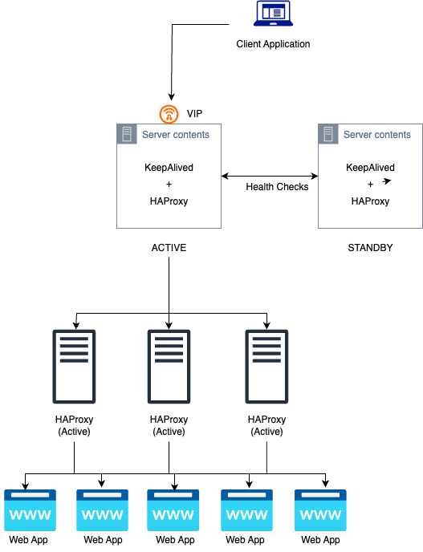

# 🧩 HAProxy Active/Active Cluster Setup

This project demonstrates a **highly available, active/active HAProxy cluster** setup with **Keepalived** for VIP management and **L4/L7 load balancing**.
It includes scripts and configurations for deploying, testing, and managing the cluster.

---

## 🚀 Overview

The setup consists of:

* **Layer 4 (L4)** HAProxy nodes configured in an **Active/Standby** mode using **Keepalived** for seamless failover via a shared **Virtual IP (VIP)**.
* **Layer 7 (L7)** HAProxy nodes configured in **Active/Active** mode to distribute traffic to backend application servers (e.g., Elixir apps).
* **Backend applications** running on port `4000`, serving as demo targets for load balancing.

---

## 🧠 Architecture



---

## ⚙️ Components

* **HAProxy (Open Source)** — Layer 4 and Layer 7 load balancing
* **Keepalived** — VIP and failover management
* **k6** — Load testing
* **socat** — Runtime inspection of HAProxy stats socket

---

## 🧰 Prerequisites

* Ubuntu/Debian-based system
* `haproxy` and `keepalived` installed
* `curl`, `socat`, and `k6` for testing and monitoring
* `sudo` privileges for system configuration

---

## 🪜 Setup Instructions

1. **Clone the repository**

   ```bash
   git clone https://github.com/NinaWendy/HALoadBalancing
   ```

2. **Configure Layer 4 and Layer 7 HAProxy**

   * Copy config files from `layer4-haproxy.cfg` and `layer7-haproxy.cfg` into `/etc/haproxy/haproxy.cfg`
   * Restart HAProxy:

     ```bash
     sudo systemctl restart haproxy
     ```

3. **Set up Keepalived**

   * Place `keepalived.conf` in `/etc/keepalived/`
   * Start and enable the service:

     ```bash
     sudo systemctl enable --now keepalived
     ```

4. **Deploy backend demo apps**

   * Example command:

     ```bash
     nohup python3 -m http.server 4000 > /tmp/web.log 2>&1 &
     ```

5. **Verify VIP failover**

   * Check which node owns the VIP:

     ```bash
     ip addr show | grep 192.168.84.100
     ```

6. **Run Load Test**

   ```bash
   k6 run k6/script.js
   ```
---

## 📊 Testing Summary

* **Failover time:** < 3 seconds
* **Load distribution:** Even across active nodes
* **Downtime:** None observed during failover
* **Requests handled (k6 test):** ~15,000 in 30s, 0 errors

---

## 🧠 Learnings

* Active/Active HAProxy ensures scalability at the L7 layer.
* Keepalived provides seamless failover and redundancy for VIPs.
* The combined approach offers a resilient and production-ready HA setup.

---

## 🧾 License

This project is open-source under the [MIT License](LICENSE).
